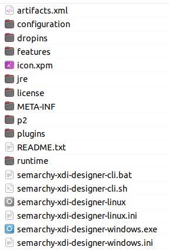
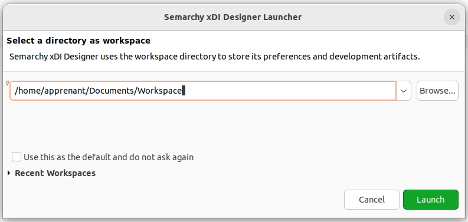

#  Semarchy xDI designer

## Description

Ce répository sert à vous guider pour installer le client semarchy-xdi-designer sur un système linux en intégrant un runtime local et un processus java. Une fois le setup réalisé, vous pourrez l'utiliser pour vous exercez avec les tutoriels fournis par le site officiel de Semarchy : 

- [**Créez votre premier flux d'intégration**](https://www.semarchy.com/tutorials-content/create-your-first-data-flow/#0)
  
- [**Travaillez avec des mappings**](https://www.semarchy.com/tutorials-content/work-with-mappings/#0)

- [**Travaillez avec des process**](https://docs.docker.com/engine/install/ubuntu/)


## Utilisation en local

### Etape 1 - Installation

1 -  Télécharger le [**xdi designer**](https://www.semarchy.com/downloads/products/2024.1/semarchy-xdi-designer-windows-linux-2024.1.1-20240117_105703.zip) et décompressez-le.

2 -  Télécharger le [**xdi runtime**](https://www.semarchy.com/downloads/products/2024.1/semarchy-xdi-runtime-2024.1.1-20240117_105703.zip), décompressez-le puis renommer le dossier en "runtime" et placez-le à la racine du dossier contenant le designer

3 - Télécharger le [**programme java**](https://download.java.net/java/GA/jdk21.0.2/f2283984656d49d69e91c558476027ac/13/GPL/openjdk-21.0.2_linux-x64_bin.tar.gz), décompressez-le puis renommer le dossier en "jre" et placez-le à la racine du dossier contenant le designer

La racine du dossier contenant le designer devrait ressembler à ceci:



### Etape 2 - Exécuter xdi Designer

1 -  Placez-vous dans le dossier semarchy-xdi-designer que vous obtenez après avoir décompresser le fichier zip, et accorder les droits pour exécuter le fichier semarchy-xdi-designer-linux avec la commande : 

```bash
  chmod +x semarchy-xdi-designer-linux
```

2 -  Afin de réaliser les tutoriels, créez un dossier Workspace (évitez de le mettre dans le répertoire comportant les éléments du designer)

3 - Lancez le xdi designer avec l'exécutable semarchy-xdi-designer-linux et choisissez votre Workspace pour démarrer votre projet.




